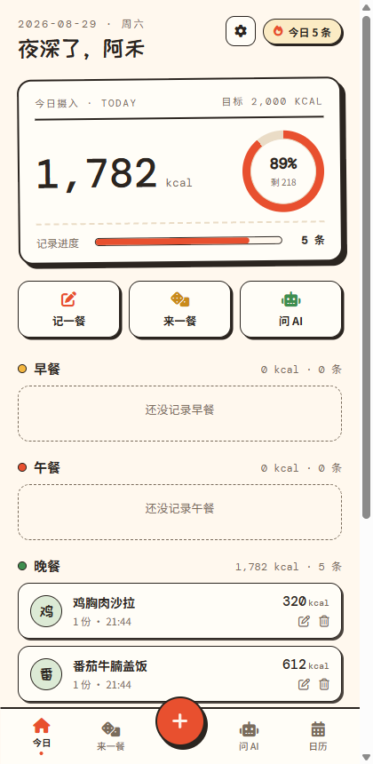
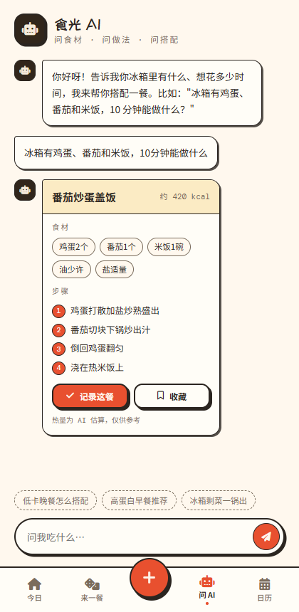
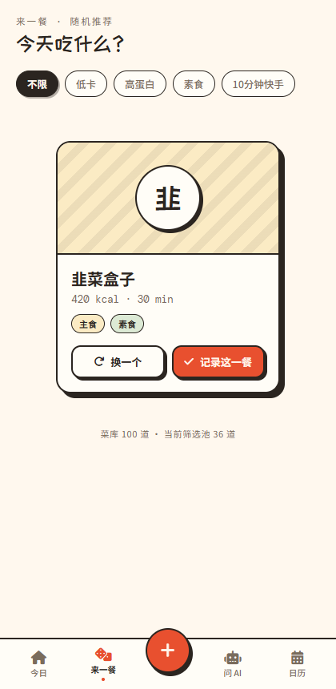
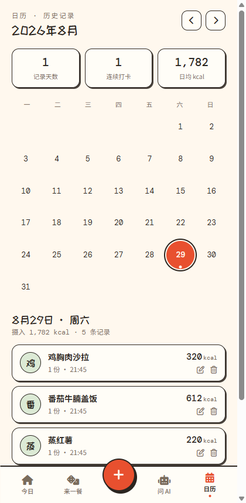

# 食光记 🍚 · 每日食物记录

> **10 秒记一餐，AI 帮你想吃啥，日历帮你回看每一顿。**

一个轻量的每日饮食记录 Web 应用。没有复杂的营养表和社交功能，只把三件事做到顺手：**快速记下今天吃了什么、纠结时让 AI 给个答案、过段时间翻回去看看**。

**🔗 在线体验：<https://sj.feimaoq.top>**

| 今日主页 | 问 AI 食谱 |
| --- | --- |
|  |  |

| 来一餐 · 随机推荐 | 日历 · 打卡回看 |
| --- | --- |
|  |  |

## ✨ 功能

- **账号系统** — 用户名 + 密码注册/登录，会话持久，数据按用户行级隔离（只有你能看到自己的记录）
- **今日主页** — 摄入热量票据卡（摄入 / 目标 / 剩余额度环形图），按早/午/晚/加餐分组的小票列表，支持编辑、删除（二次确认）
- **记一餐** — 只填食物名就能保存；热量可留空交给 AI 估算；常吃食物一键回填；支持补记过去 7 天
- **来一餐 🎲** — 内置 100 道家常菜一键随机，支持低卡 / 高蛋白 / 素食 / 10 分钟快手筛选，抽到合意的**一键记录**
- **问 AI 🤖** — 告诉它你冰箱里有什么、想花多少时间，返回结构化食谱卡（食材 / 步骤 / 热量），同样**一键记录**；非饮食问题也能正常聊天
- **日历 📅** — 月历打卡印章、连续打卡天数、日均热量，任意日期回看明细
- **我的** — 昵称、每日热量目标、素食偏好（开启后随机推荐只抽素食）

## 🚀 快速使用

1. 打开 **<https://sj.feimaoq.top>**
2. 注册一个账号（用户名 2–20 字符，密码至少 8 位且含字母和数字）
3. 三种记录方式，按需选择：
   - **吃完了才想起来** → 首页点红色 **＋** → 填名字、选餐次 → 保存
   - **纠结吃什么** → 底部 Tab「来一餐」→ 点骰子 → 合意就点「记录这一餐」
   - **冰箱剩食材不知道怎么做** → Tab「问 AI」→ 直接问（如"冰箱有鸡蛋、番茄和米饭，10 分钟能做什么？"）→ 食谱卡上点「记录这餐」
4. 想回看 → Tab「日历」→ 点任意日期；想改目标热量/昵称 → 首页右上角 ⚙️

> 热量均为 AI 估算值，仅供参考。

## 🛠 技术栈

| 层 | 选型 |
| --- | --- |
| 前端 | Vite 5 + React 18 + TypeScript（strict），无路由库（视图状态机），手写 CSS 设计令牌（市集手账风 🧾） |
| 认证 | CloudBase 内置用户名密码登录 + 自定义登录桥接（`auth-bridge` 云函数，scrypt 哈希存储） |
| 数据 | CloudBase 文档型数据库（`profiles` / `food_records` / `dishes`），安全规则行级隔离 |
| AI | 云函数 `ai-proxy` 中转 `hy3` 模型（成长计划免费额度），输出结构化食谱 JSON；429 限流自动退避重试 |
| 部署 | CloudBase 静态托管（独立子域名）+ 自定义域名 `sj.feimaoq.top` |

**为什么 AI 走云函数？** 成长计划赠送的 AI 额度仅限小程序 SDK / 云函数消耗，浏览器直连无法使用，因此在云函数中转，前端零成本调用。

## 💻 本地开发

```bash
git clone <本仓库>
cd 每日食物2
npm install
cp .env.example .env   # 填入你的 CloudBase 环境 ID / 区域 / publishable key
npm run dev            # http://localhost:5173
```

常用命令：

```bash
npm run dev        # 开发服务器
npm test           # vitest 单元测试（33 个用例）
npm run typecheck  # tsc --noEmit
npm run build      # 类型检查 + 生产构建到 dist/
```

> 本地调试需把 `localhost:5173` 加入 CloudBase 环境「安全域名」；线上部署域名同理。

### 云函数

| 函数 | 作用 | 环境变量 |
| --- | --- | --- |
| `cloudfunctions/auth-bridge` | 用户名注册/登录 + 自定义登录 ticket 签发（密码 scrypt 加盐哈希） | `TCB_ENV_ID`、`TCB_CUSTOM_KEY_ID`、`TCB_CUSTOM_PRIVATE_KEY` |
| `cloudfunctions/ai-proxy` | AI 食谱 + 热量估算（函数内校验登录身份） | `AI_MODEL_ID` |

> ⚠️ 两个函数的密钥均通过**函数环境变量**注入，仓库中不含任何密钥材料。

## 📦 部署

前端构建产物部署到 CloudBase 静态托管（`manageApps` 独立子域名），云函数用 `manageFunctions` 部署（`ai-proxy` 需 `isWaitInstall` 安装依赖）。SPA 回退已配置（404 → index.html）。详细步骤与踩坑记录见 [`docs/开发计划.md`](docs/开发计划.md) 第 10 节执行记录。

## 📁 目录结构

```
├── docs/                  # 需求文档、原型图、开发计划、产品截图
├── cloudfunctions/        # 云函数（auth-bridge / ai-proxy）
├── src/
│   ├── lib/               # CloudBase 初始化、认证、AI、数据仓库、纯函数工具（含单测）
│   ├── components/        # 票据卡、小票行卡、食谱卡、TabBar、Toast…
│   ├── screens/           # 登录 / 主页 / 记一餐 / 来一餐 / 问AI / 日历 / 设置
│   └── styles/            # 设计令牌与全局样式
└── README.md
```

## 📄 文档

- [用户需求文档（PRD）](docs/用户需求文档.md) — 功能范围、数据模型、验收标准
- [可交互原型图](docs/原型图.html) — 浏览器打开即可点击体验全部流程
- [开发计划与执行记录](docs/开发计划.md) — 里程碑、CloudBase 踩坑实录

## License

仅供学习交流使用。
